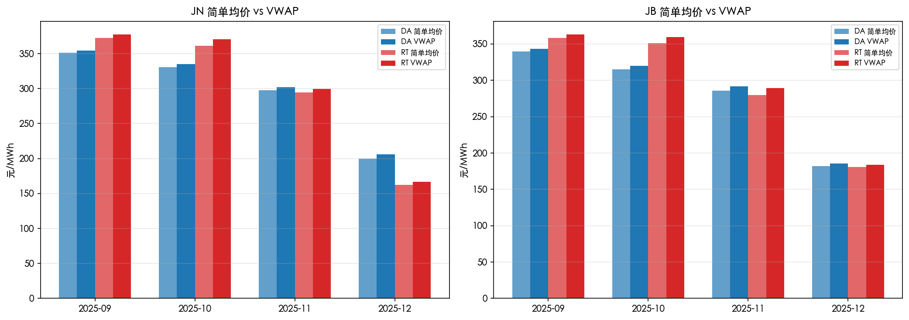
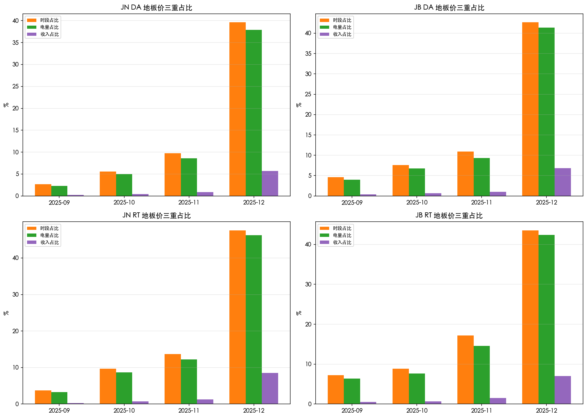
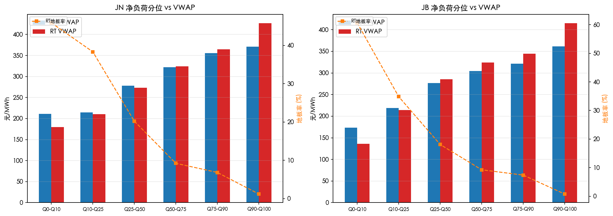
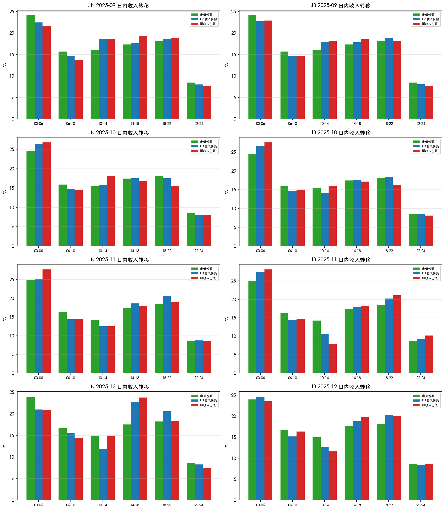
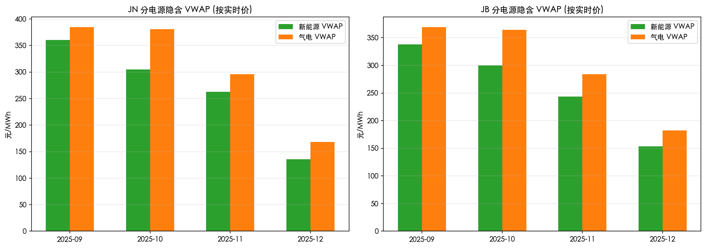
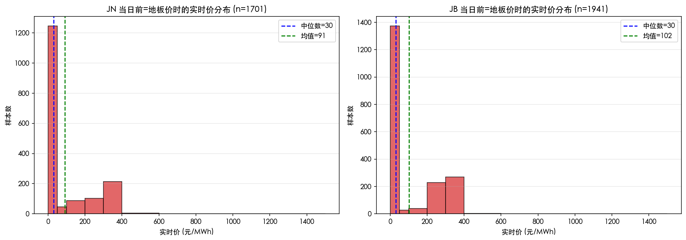

# 电量加权价格分析报告 (VWAP Analysis)

> 数据范围：2025-09 ~ 2025-12（122 天 × 96 时段 = 11,712 条记录）
> 分析脚本：`scripts/analyze_vwap.py`
> 图表输出：`report/vwap_analysis/`

---

## 1. 分析动机

前期时段边界分析仅以"有多少时段是地板价"来度量地板价的影响，但这忽略了一个关键维度：**电量**。
一个凌晨 3 点的地板价时段（负荷约 65 GW）与下午 4 点的地板价时段（负荷约 95 GW）对市场收入的影响完全不同。
因此，本报告从电量加权（Volume-Weighted Average Price, VWAP）的视角，重新审视江苏电力现货市场的价格结构。

---

## 2. 简单均价 vs VWAP

| 月份 | 区域 | DA 简均 | DA VWAP | RT 简均 | RT VWAP | 日均 GWh |
|:---:|:---:|:---:|:---:|:---:|:---:|:---:|
| 2025-09 | JN | 351.1 | 354.1 | 372.4 | 377.6 | 2352.8 |
| 2025-09 | JB | 339.7 | 343.2 | 358.3 | 363.3 | 2352.8 |
| 2025-10 | JN | 330.9 | 334.9 | 361.0 | 370.4 | 2004.4 |
| 2025-10 | JB | 315.3 | 319.9 | 351.2 | 359.5 | 2004.4 |
| 2025-11 | JN | 297.5 | 302.2 | 294.5 | 299.8 | 1955.8 |
| 2025-11 | JB | 286.0 | 291.8 | 279.7 | 289.1 | 1955.8 |
| 2025-12 | JN | 199.7 | 206.3 | 162.5 | 166.9 | 2108.9 |
| 2025-12 | JB | 182.1 | 185.6 | 180.9 | 184.0 | 2108.9 |

**核心发现**：

- **VWAP 系统性高于简单均价**，幅度约 3–10 元/MWh。说明高负荷时段（通常高价）消费了更多电量，因此从发电侧看"真实成交价"比时段简单平均更高。
- **RT VWAP > DA VWAP**（9–10 月），对应实时市场的价格波动高于日前。但 12 月 RT VWAP < DA VWAP（JN：167 vs 206），体现了 12 月大量实时地板价拉低了收入。
- **差距在 12 月最大**（DA VWAP 比简均高 6.6 元），因为 12 月地板价集中在低负荷时段，高负荷时段价格仍较高，VWAP 将权重向高价偏移。

---

## 3. 地板价三重占比：时段 / 电量 / 收入

| 月份 | 区域 | 类型 | 时段占比 | 电量占比 | 收入占比 | 地板时段均荷 GW |
|:---:|:---:|:---:|:---:|:---:|:---:|:---:|
| 全量 | JN | DA | 14.5% | 13.4% | 1.4% | 81.2 |
| 全量 | JN | RT | 18.8% | 17.6% | 1.8% | 81.7 |
| 全量 | JB | DA | 16.6% | 15.4% | 1.7% | 81.4 |
| 全量 | JB | RT | 19.3% | 17.7% | 1.8% | 80.4 |
| 2025-12 | JN | DA | 39.6% | 37.9% | 5.7% | 84.0 |
| 2025-12 | JN | RT | 47.5% | 46.2% | 8.5% | 85.5 |
| 2025-12 | JB | DA | 42.7% | 41.3% | 6.9% | 85.1 |
| 2025-12 | JB | RT | 43.5% | 42.4% | 7.0% | 85.5 |

**核心发现**：

1. **电量占比 < 时段占比**：全量看，RT 地板价占 18.8% 时段但只占 17.6% 电量。说明地板价确实偏向低负荷时段，但差距不大（仅 1.2 个百分点），**地板价并非仅出现在深夜低谷**。

2. **收入占比极低**：地板价占 ~18% 时段 / ~18% 电量，但只贡献 ~1.8% 收入。这意味着接近 1/5 的电量只换来了不到 2% 的收入，对发电商来说是巨大的经济损失。

3. **12 月极端化**：RT 地板价占 47.5% 时段、46.2% 电量、但只占 8.5% 收入。接近一半的电量以地板价成交，但仅贡献不到一成收入。

4. **地板时段均荷 80–85 GW**，略低于全量均荷（~87 GW），进一步印证地板价主要但不完全集中在低负荷时段。12 月地板时段均荷甚至达到 84–85 GW（接近 12 月整体均荷），说明 12 月的地板价已经蔓延到中等负荷时段。

---

## 4. 净负荷条件 VWAP

| 净负荷分位 | 范围 (GW) | JN DA VWAP | JN RT VWAP | JN RT 地板率 | JB RT VWAP | JB RT 地板率 |
|:---:|:---:|:---:|:---:|:---:|:---:|:---:|
| Q0–Q10 | 39.9~61.3 | 211.1 | 179.7 | 45.9% | 136.0 | 60.7% |
| Q10–Q25 | 61.3~71.0 | 214.7 | 210.6 | 38.3% | 213.9 | 34.9% |
| Q25–Q50 | 71.0~80.4 | 278.2 | 273.3 | 20.2% | 285.2 | 18.1% |
| Q50–Q75 | 80.4~89.0 | 322.4 | 324.0 | 9.2% | 324.4 | 9.3% |
| Q75–Q90 | 89.0~96.4 | 355.9 | 364.4 | 6.8% | 344.6 | 7.4% |
| Q90–Q100 | 96.4~127.7 | 370.8 | 426.8 | 1.2% | 415.1 | 0.8% |

**核心发现**：

1. **净负荷与价格高度单调相关**：从 Q0 到 Q100，DA VWAP 从 ~211 上升到 ~371 元/MWh（JN），RT VWAP 从 ~180 飙升到 ~427。

2. **低净负荷 = 高地板率**：Q0–Q10（净负荷 < 61 GW）时，JB 实时地板率高达 **60.7%**，JN 也有 45.9%。这直接反映了新能源大发 → 净负荷下降 → 供过于求 → 地板价的链条。

3. **高净负荷 RT 显著高于 DA**：Q90–Q100 时 RT VWAP 比 DA VWAP 高 50–60 元/MWh，说明在紧张供需条件下，实时价格的弹性远高于日前——这正是"实时补回"机制生效的区间。

---

## 5. 日内收入转移效应

**核心发现**：

1. **00–06 时段块**：电量份额约 24%，但 DA/RT 收入份额仅约 21–23%（9 月）→ 16–18%（12 月）。夜间用电量大，但价格低，收入份额被压缩。12 月尤为明显：24% 电量仅换来 ~16% 收入。

2. **14–18 和 18–22 时段块**是收入富集区。以 12 月 JN 为例：14–18 时段电量 17% 但 DA 收入 23%、RT 收入 21%；18–22 时段电量 18% 但 DA 收入 22%、RT 收入 20%。

3. **实时收入转移幅度大于日前**：10 月 JN 00–06 块电量 25% 但 RT 收入高达 27%（因为凌晨实时尖峰），而 DA 只有 22%。说明实时市场的价格波动放大了日内收入再分配。

---

## 6. 分电源隐含 VWAP

> 注：此处使用省总负荷数据作为电量代理，并以各电源实际出力乘以同时段实时价来估算隐含收入，是简化估算。

**核心发现**：

1. **新能源 VWAP 系统性低于气电 VWAP**：每个月新能源的隐含成交均价都低于气电 20–40 元/MWh。原因是新能源出力集中在日间（光伏）和夜间（风电），这些时段恰好是低价时段。

2. **新能源 VWAP 下降速度快于气电**：9 月 JN 新能源 VWAP 约 360 元/MWh → 12 月仅约 135 元/MWh，降幅 63%。而同期气电从 385 → 167，降幅 57%。新能源在低价月份承受了更大的收入损失。

3. **这印证了"新能源自我蚕食"效应**：随着新能源渗透率上升，其出力时段的价格被自身供给压低，导致 VWAP 加速下滑。

---

## 7. 日前地板价时段的实时价条件分析

| 指标 | JN | JB |
|:---|:---:|:---:|
| 日前地板价样本数 | 1701 (14.5%) | 1941 (16.6%) |
| 对应实时价均值 | 90.8 | 102.5 |
| 对应实时价中位数 | 30.0 | 30.0 |
| 实时也是地板的概率 | 74.5% | 71.6% |
| 实时 > 200 元 | 18.8% | 25.5% |
| 实时 ≥ 400 元 | 0.2% | 0.2% |
| 实时–日前 价差均值 | +59.6 | +71.6 |
| 地板时段电量占比 | 13.4% | 15.4% |
| 地板时段 RT 收入占比 | 4.0% | 5.2% |

**核心发现**：

1. **日前地板 ≠ 实时地板**：当日前出清为地板价时，约 **25–29%** 的时段实时价格反弹至地板价以上。其中 JB 有 25.5% 的概率实时价 > 200 元/MWh。

2. **双峰分布显著**：分布图呈明显的"J 形"——绝大多数（~72–75%）实时价仍为地板（≤50），但有一个明显的第二峰出现在 200–400 元区间。这支持了"部分时段通过实时市场回补"的假说。

3. **实时–日前价差均值 +60~+72 元**：虽然中位数仍为 0（双方都是地板），但均值被少数大额正价差拉高，说明"回补效应"虽不普遍但金额显著。

4. **电量占比 vs 收入占比放大**：JB 地板时段占 15.4% 电量但贡献 5.2% RT 收入（3x 放大）。如果实时完全不反弹，收入占比应与 `(地板价/均价) × 电量占比 ≈ 0.15 × 50/300 ≈ 2.5%` 一致。实际 5.2% 说明实时反弹确实带来了额外收入。

---

## 8. 综合结论

### 8.1 对"保开机贴地板 + 实时补回"假说的量化验证

| 验证维度 | 结论 |
|:---|:---|
| 地板价是否集中在低负荷时段？ | **部分是**。地板时段均荷 80–81 GW（略低于全量 87 GW），但 12 月地板价已蔓延至中等负荷段 |
| 低净负荷是否导致地板？ | **强因果**。净负荷 Q0–Q10 时 RT 地板率 46–61%，Q90–Q100 时仅 1% |
| 日前地板时段实时是否反弹？ | **部分成立**。~25% 的概率实时价 > 地板，均值回升 60–72 元，但 ~75% 仍是地板 |
| 实时补回在经济上是否有效？ | **有限有效**。地板时段 RT 收入占比(4–5%)高于纯地板应有水平(~2.5%)，但远不够覆盖损失 |
| 新能源是否"自我蚕食"？ | **是**。新能源 VWAP 从 360 下降到 135 元/MWh（12 月），降速快于气电 |

### 8.2 对预测模型的启示

1. **VWAP 可作为评估指标**：传统 MAE/RMSE 对所有时段等权，但从经济角度看，高负荷时段的预测误差代价更大。可考虑引入电量加权的损失函数。

2. **净负荷是极端价格的最强预测信号**：净负荷 < 61 GW 几乎必然出现地板价，> 96 GW 几乎不出现。这应是分类模型的首要特征。

3. **日前–实时价差的双峰结构**为实时价预测提供了先验：当日前为地板时，实时价大概率仍为地板，但有 ~25% 的概率出现 100–400 元的反弹。

---

## 附录：文件清单

| 文件 | 说明 |
|:---|:---|
| `scripts/analyze_vwap.py` | 分析脚本 |
| `report/vwap_analysis/1_vwap_vs_simple_avg.png` | 简均 vs VWAP |
| `report/vwap_analysis/2_floor_triple_shares.png` | 地板价三重占比 |
| `report/vwap_analysis/3_netload_conditional_vwap.png` | 净负荷条件 VWAP |
| `report/vwap_analysis/4_intraday_revenue_transfer.png` | 日内收入转移 |
| `report/vwap_analysis/5_source_implied_vwap.png` | 分电源隐含 VWAP |
| `report/vwap_analysis/6_da_floor_rt_distribution.png` | 日前地板→实时价分布 |
| `report/vwap_analysis/vwap_analysis_summary.json` | 全量数据摘要 |
